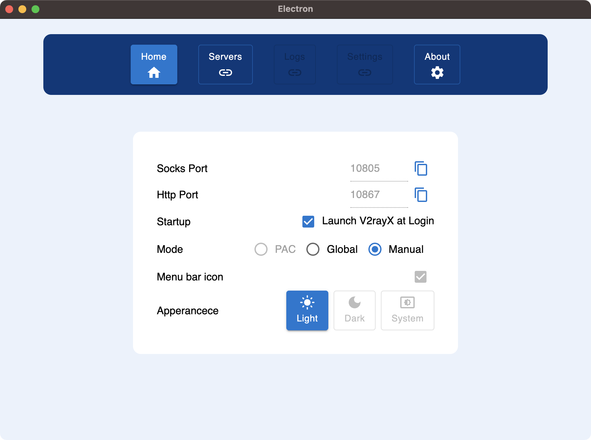
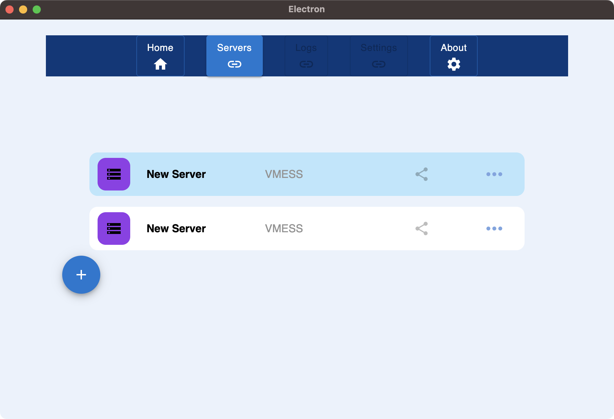
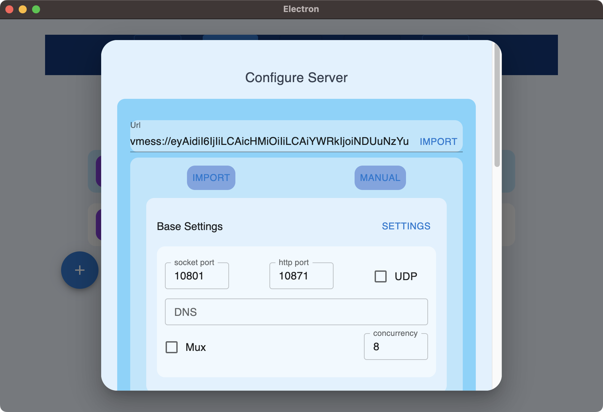
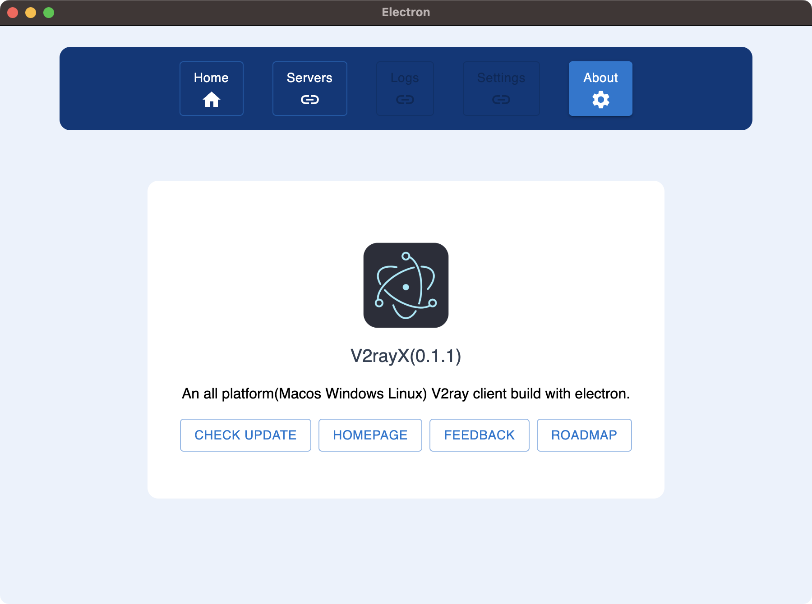

```txt
██╗░░░██╗██████╗░██████╗░░█████╗░██╗░░░██╗██╗░░██╗
██║░░░██║╚════██╗██╔══██╗██╔══██╗╚██╗░██╔╝╚██╗██╔╝
╚██╗░██╔╝░░███╔═╝██████╔╝███████║░╚████╔╝░░╚███╔╝░
░╚████╔╝░██╔══╝░░██╔══██╗██╔══██║░░╚██╔╝░░░██╔██╗░
░░╚██╔╝░░███████╗██║░░██║██║░░██║░░░██║░░░██╔╝╚██╗
░░░╚═╝░░░╚══════╝╚═╝░░╚═╝╚═╝░░╚═╝░░░╚═╝░░░╚═╝░░╚═╝
```

[● Telegram Channel](https://t.me/V2rayX_electron)

# WARN: text below will change in development. product is not ready to release beta (release day will be soon)

## I. V2ray Electron

V2ray GUI client with cross-platform desktop support powered by Electron⚛️, made specially for Linux / Windows / MacOS users.

### ➣ Tested on

- Ubuntu22.10 (amd64)
- MacOS Ventura (x64)
- Windows10/11 (x64)

### ➣ Future test plan

- Linux Kali/Manjaro (x64)

## II. Features

### ➣ Supported (TODO List)

- [ ] **SS / SSR** Protocol
- [ ] **PAC** Mode
  - Auto proxy mode for browser that use [GFWList](https://raw.githubusercontent.com/gfwlist/gfwlist/master/gfwlist.txt) as default rules.
  - Allow custom rules.
- [x] **Global** Mode
  - Global socks5 proxy for browser.
- [x] **Manual** Mode
  - Get some tools like SwitchOmega to enable browser proxy on this mode.
- [x] **HTTP(S)** Proxy
  - On Windows, commands for terminal proxy(port 1087 as default):
    - `$env:HTTPS_PROXY="http://127.0.0.1:1087"` (powershell)
    - `$env:HTTP_PROXY="http://127.0.0.1:1087"` (powershell)
    - `set http_proxy=http://127.0.0.1:1087` (cmd)
    - `set https_proxy=http://127.0.0.1:1087` (cmd)
  - On Linux/MacOS, commands for terminal proxy:
    - `export http_proxy="127.0.0.1:1087"`
    - `export https_proxy="127.0.0.1:1087"`
    - Some tools like `proxychains` is deep recommended.
- [x] Clipboard
- [ ] QR-code Import
- [ ] Subscription Import
- [ ] Language Detecting And Switching (zh-CN / en-US / ru-RU)
- [ ] Configuration Backup / Recovery
- [ ] Dark / Light Mode
- [x] Auto Start (Not support on Linux)
- [ ] Server Share
- [ ] Activity Logs

### ➣ In Testing

- [ ] **PAC** Mode
- [ ] QR-code Import
- [ ] Dark / Light Mode
- [ ] Server Share

### ➣ Comming Soon

## III. Problems

## IV. Supported Platforms & Arch


> More architectures will be supported if necessary, just give me an issue.

- Ubuntu
  - deb `x64/x86/arm64`
  - AppImage `x64/x86/arm64`
  - snap `x64/x86/arm64`
- MacOS
  - dmg `x64/arm64`
  - zip `x64/arm64`
- Windows
  - exe `x64/x86/arm64`
  - zip `x64/x86/arm64`

## V. Screenshots

### Home Page



### Server Page



### Server Add



### About Page



## VI. Downloads

- GitHub Releases

  - 
  - [↪ releases page](https://github.com/shaonhuang/V2rayX/releases/latest)

- Snapcraft Store (linux)

  - [](https://snapcraft.io/v2rayx)
  - [↪ home page](https://snapcraft.io/v2rayx)

## VII. Plugins Downloads

after install, app will auto install v2ray component.

## IX. Why?

This project was heavily inspired by yanue/V2rayU, which uses packed v2ray-core to avoid complex intallation with native O-C code.But it is not intuitive to use.Only support macos.

I wish to create a web development work flow to work with frondend and backend, and app need a little bit of user interface and it has to be cross-platform.

Hence, the app is created.Welcome to pull or make pr.

## X. Development

### 1. Env

- Node@^`18.14.0`
- Ubuntu18.04 or higher version
- Mac catalina or other versions (works in most recent versions in theory)
- Windows 10 (WSL tested) or higher version

### 2. Prepare

```bash
# for ubuntu developers
# for mac developers

# proxy env set (if your local machine support)
export HTTPS_PROXY=http://127.0.0.1:<port>
export HTTP_PROXY=http://127.0.0.1:<port>
```

### 3. Run commands in terminal

```bash
# [01]clone
$: git clone https://github.com/shaonhuang/V2rayX.git
$: cd v2rayx

# for china developers
$: npm config set electron_mirror http://npm.taobao.org/mirrors/electron/

# [02]npm
$: npm i -g yarn
$: yarn set version stable

# [03]yarn install
$: yarn install

# [04]dev
$: yarn dev
```

## XI. Mention

## XII. Credit

- [yanue/V2rayU](https://github.com/yanue/V2rayU/tree/master)
