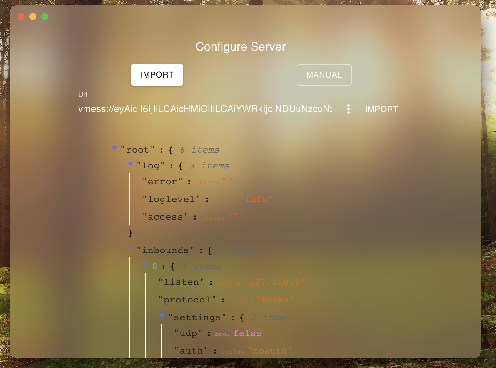
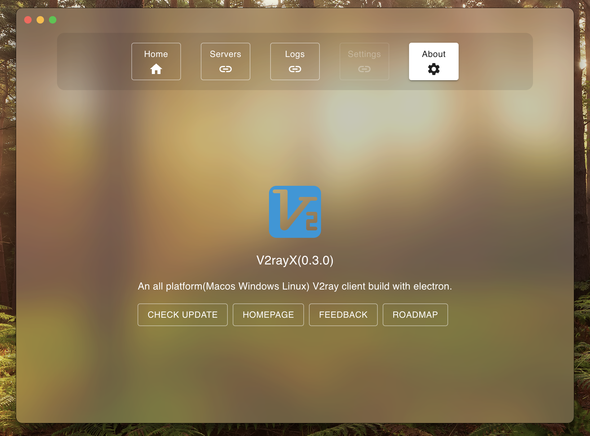
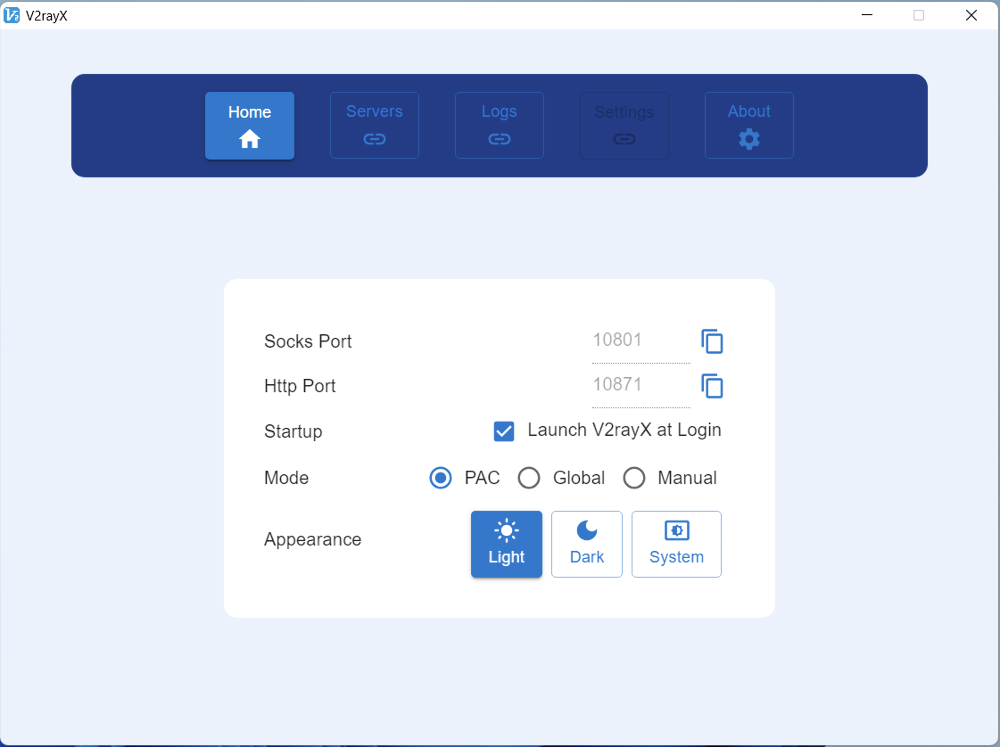
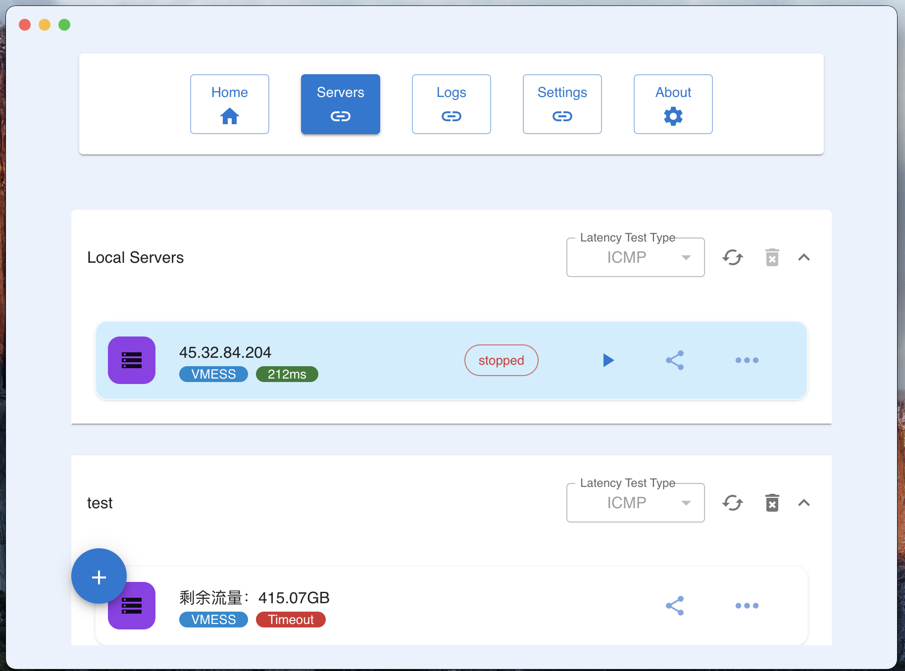
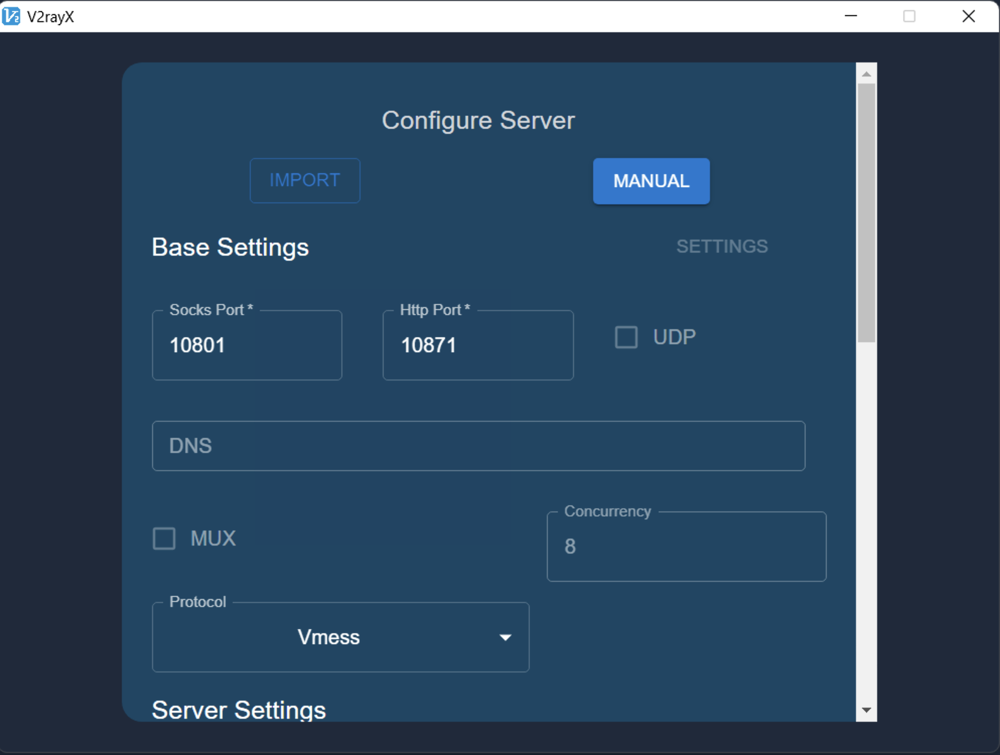
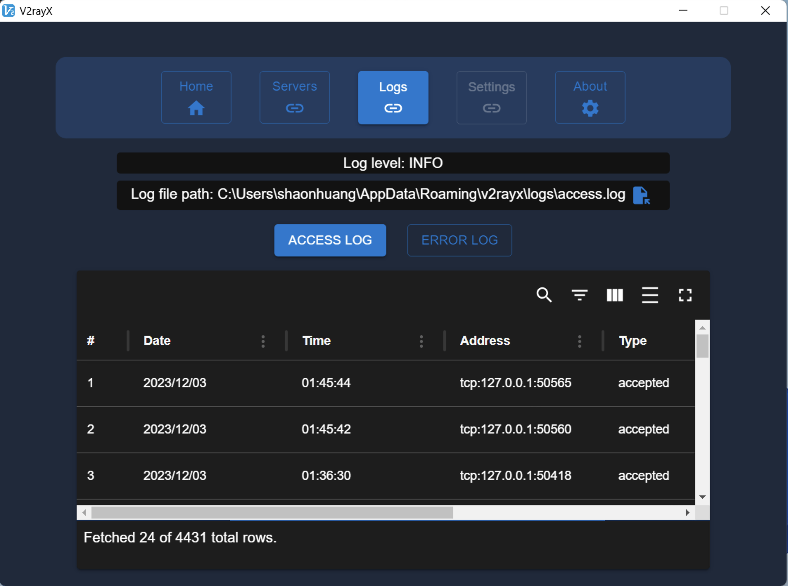
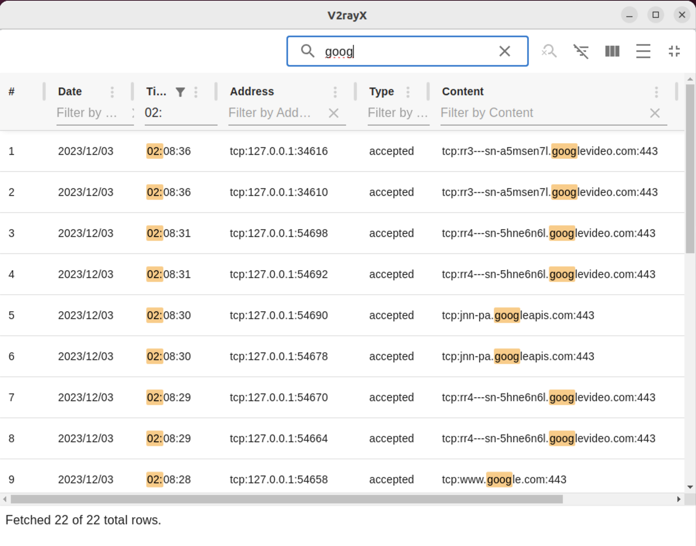

```txt {"id":"01HJTETYFF2MZB43GCH8XQRFYR"}
██╗░░░██╗██████╗░██████╗░░█████╗░██╗░░░██╗██╗░░██╗
██║░░░██║╚════██╗██╔══██╗██╔══██╗╚██╗░██╔╝╚██╗██╔╝
╚██╗░██╔╝░░███╔═╝██████╔╝███████║░╚████╔╝░░╚███╔╝░
░╚████╔╝░██╔══╝░░██╔══██╗██╔══██║░░╚██╔╝░░░██╔██╗░
░░╚██╔╝░░███████╗██║░░██║██║░░██║░░░██║░░░██╔╝╚██╗
░░░╚═╝░░░╚══════╝╚═╝░░╚═╝╚═╝░░╚═╝░░░╚═╝░░░╚═╝░░╚═╝
```

[● Telegram Channel](https://t.me/V2rayX_electron)

# WARN: The text below will change in development. product is ready for pre-release

## I. V2ray Electron

V2ray GUI client with cross-platform desktop support powered by Electron⚛️, made especially for Linux / Windows / MacOS users.

### ➣ Tested on

- Ubuntu22.10 (amd64, arm64)
- MacOS Ventura (Intel, M1+)
- Windows10/11 (x64)

### ➣ Future test plan

- Linux Kali/Manjaro (x64)

## II. Features

### ➣ Supported (TODO List)

- [x] **PAC** Mode

  - Auto proxy mode for browsers that use [GFWList](https://raw.githubusercontent.com/gfwlist/gfwlist/master/gfwlist.txt) as default rules.
  - Allow custom rules.

- [x] **Global** Mode

  - Global socks5 proxy for browser.

- [x] **Manual** Mode

  - Get some tools like SwitchOmega to enable browser proxy on this mode.

- [x] **HTTP(S)** Proxy

  - On Windows, commands for terminal proxy(port 1087 as default):

    - `$env:HTTPS_PROXY="http://127.0.0.1:10871"` (PowerShell)
    - `$env:HTTP_PROXY="http://127.0.0.1:10871"` (PowerShell)
    - `set http_proxy=http://127.0.0.1:10871` (cmd)
    - `set https_proxy=http://127.0.0.1:10871` (cmd)

  - On Linux/MacOS, commands for terminal proxy:
    - `export http_proxy="127.0.0.1:10871"`
    - `export https_proxy="127.0.0.1:10871"`
    - Some tools like `proxychains` are deeply recommended.

- [x] Clipboard
- [x] QR-code Import
- [x] Subscription Import
- [ ] Language Detecting And Switching (zh-CN / en-US / ru-RU)
- [ ] Configuration Backup / Recovery
- [x] Dark / Light Mode
- [x] Auto Start (Not supported on Linux)
- [x] Server Share
- [x] Activity Logs
- [x] Support VMess/VLess/Trojan Import

### ➣ In Testing

- [ ] QR-code Import

### ➣ Comming Soon

## III. Problems

## IV. Supported Platforms & Arch

 [](https://github.com/shaonhuang/V2rayX/actions/workflows/publish.yml)

> More architectures will be supported if necessary, just give me an issue.

- Ubuntu

  - deb `x64/arm64`
  - pacman `x64/arm64`
  - AppImage `x64/arm64`
  - snap `x64/arm64(Easy Intall On SnapStore)`

- MacOS (M1+, Intel)

  - dmg `x64/arm64`
  - zip `x64/arm64`

- Windows 10/11
  - exe `x64/arm64`
  - zip `x64/arm64`

## V. Screenshots

### For MacOS (v0.3.3 style) (v0.4.0+ is like Windows style.)

#### Home Page


#### Server Page


#### Server Add




#### Settings Page


#### Logs Page


#### About Page



### For Windows10/11 and Linux

#### Home Page



#### Server Page



#### Server Add



#### Logs Page




#### About Page


#### Tray Tool Bar


## VI. Downloads

- GitHub Releases

  - 
  - [↪ releases page](https://github.com/shaonhuang/V2rayX/releases/latest)

- Snapcraft Store (Linux)

  - [](https://snapcraft.io/v2rayx)
  - [↪ home page](https://snapcraft.io/v2rayx)

## VII. Why?

This project was heavily inspired by yanue/V2rayU, which uses packed v2ray-core to avoid complex installation with native O-C code. But it is not intuitive to use. Only support macOS.

I work with different operating systems that need a proxy environment, and I hope the app has a little bit of a user interface and it has to be cross-platform.

Hence, the app is created. Welcome to pull or make PR.

## VIII Sponsor

Life is hard. Maybe a coffee would help.❤️❤️🙏🙏💪💪

[](https://www.buymeacoffee.com/shaonhuang)

## IX. Development

### 1. Env

- Node@^`18.17.0`
- Ubuntu18.04 or higher version
- Mac Catalina or other versions (works in most recent versions in theory)
- Windows 10 (WSL tested) or higher version

### 2. Prepare

```bash {"id":"01HJTETYFF2MZB43GCH9A88YPD"}
# for Ubuntu developers
# for Mac developers

# proxy env set (if your local machine support it)
export HTTPS_PROXY=http://127.0.0.1:<port>
export HTTP_PROXY=http://127.0.0.1:<port>
```

### 3. Run commands in the terminal

```bash {"id":"01HJTETYFF2MZB43GCHC2T3BMR"}
# [01]clone
$: git clone https://github.com/shaonhuang/V2rayX.git
$: cd v2rayx

# [02]npm install yarn(v4)   
$: npm i -g yarn
$: yarn set version stable

# [03]yarn install
$: yarn install

# [04]dev
$: yarn dev
```

## X. Mention

## XI. Credit

## 

- [yanue/V2rayU](https://github.com/yanue/V2rayU/tree/master)
